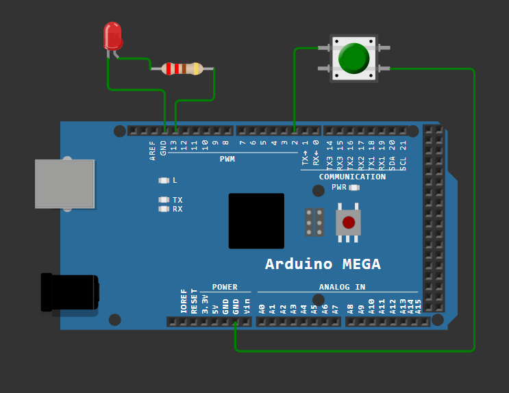

# 💡 Controlul unui LED utilizand un buton

---

# 📖 Descriere

Acest proiect prezinta una dintre cele mai simple aplicatii realizate cu placa **Arduino Mega 2560**, avand ca scop controlul unui LED prin intermediul unui buton.

La apasarea butonului, Arduino citeste starea intrarii digitale si controleaza aprinderea sau stingerea LED-ului conectat la iesirea digitala. Proiectul reprezinta un exemplu introductiv pentru intelegerea modului de utilizare a intrarilor si iesirilor digitale.

---

# 🔧 Componente utilizate

- Arduino Mega 2560
- LED
- Buton
- Rezistenta 220 Ω
- Rezistenta 10 kΩ
- Breadboard
- Fire de conexiune

---

# 📂 Continutul proiectului

| Fisier | Descriere |
|---------|-----------|
| Buton + Led-Cod sursa.txt | Codul sursa al proiectului |
| Schema.png | Schema electrica |
| Demo.mp4 | Demonstratie video |
| Documentatie.pdf | Documentatia completa |

---

# ▶️ Demonstratie

Functionarea proiectului poate fi observata in videoclipul **Demo.mp4**, unde este prezentata interactiunea dintre buton si LED.

Explicatiile complete privind implementarea proiectului sunt disponibile in fisierul **Documentatie.pdf**.

---

# 👨‍💻 Autor

**Daniel Petrescu**

Facultatea de Electronica, Telecomunicatii si Tehnologia Informatiei

Universitatea Nationala de Stiinta si Tehnologie POLITEHNICA Bucuresti