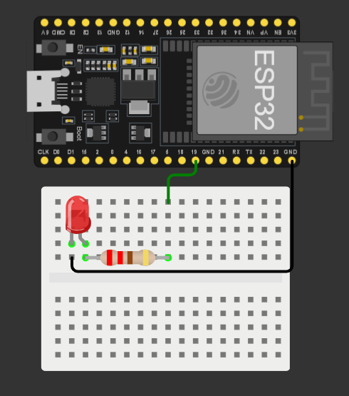

# 📶 Comunicatie Bluetooth cu ESP32

---

# 📖 Descriere

Acest proiect prezinta realizarea unei comunicatii Bluetooth utilizand placa ESP32.

ESP32 functioneaza ca dispozitiv Bluetooth si permite schimbul de date cu un telefon mobil sau cu un calculator, oferind posibilitatea transmiterii si receptionarii informatiilor prin intermediul unei conexiuni wireless.

Proiectul evidentiaza utilizarea modulului Bluetooth integrat al placii ESP32 si reprezinta una dintre cele mai simple metode de comunicatie wireless intre un microcontroler si un dispozitiv extern.

---

# 🔧 Componente utilizate

- ESP32
- Telefon mobil
- Breadboard
- Fire de conexiune

---

# 📂 Continutul proiectului

| Fisier | Descriere |
|---------|-----------|
| ESP32-Bluetooth-Cod.txt | Codul sursa al proiectului |
| Montaj.png | Fotografia montajului |
| Demo.mp4 | Demonstratie video |
| Documentatie.pdf | Documentatia completa |

---

# ▶️ Demonstratie

Functionarea proiectului poate fi observata in videoclipul **Demo.mp4**.

Documentatia completa este disponibila in fisierul **Documentatie.pdf**.

---

# 👨‍💻 Autor

**Daniel Petrescu**

Facultatea de Electronica, Telecomunicatii si Tehnologia Informatiei

Universitatea Nationala de Stiinta si Tehnologie POLITEHNICA Bucuresti