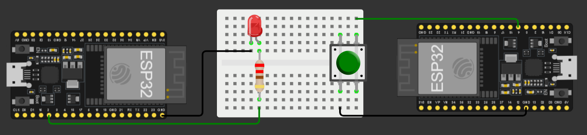

# 📡 Comunicatie wireless utilizand ESP-NOW si Bluetooth

---

# 📖 Descriere

Acest proiect prezinta doua metode de comunicatie wireless realizate utilizand doua placi ESP32.

Prima metoda utilizeaza protocolul **ESP-NOW**, care permite transmiterea directa a datelor intre cele doua microcontrolere fara utilizarea unei retele Wi-Fi sau a unui router.

A doua metoda utilizeaza comunicatia **Bluetooth**, demonstrand schimbul de date dintre cele doua dispozitive prin intermediul modulului Bluetooth integrat al placii ESP32.

Implementarea celor doua variante permite compararea modului de functionare al fiecarei tehnologii si evidentiaza avantajele acestora in aplicatii embedded si IoT.

---

# 🔧 Componente utilizate

- 2 × ESP32
- Breadboard
- Fire de conexiune

---

# 📂 Continutul proiectului

| Fisier | Descriere |
|---------|-----------|
| COD CONEXIUNI ESP-NOW-Cod sursa.txt | Codul sursa pentru comunicatia ESP-NOW |
| COD CONEXIUNI BLUETOOTH-Cod sursa.txt | Codul sursa pentru comunicatia Bluetooth |
| Demo-Esp NOW.mp4 | Demonstratie comunicatie ESP-NOW |
| Demo- Bluetooth.mp4 | Demonstratie comunicatie Bluetooth |
| Schema.png | Schema electrica a proiectului |
| Documentatie.pdf | Documentatia completa a proiectului |

---

# ▶️ Demonstratie

Proiectul include doua videoclipuri demonstrative:

- **Demo-Esp NOW.mp4** – comunicatia dintre cele doua placi ESP32 utilizand protocolul ESP-NOW.
- **Demo- Bluetooth.mp4** – comunicatia dintre cele doua placi ESP32 utilizand Bluetooth.

Explicatiile complete privind implementarea proiectului sunt disponibile in fisierul **Documentatie.pdf**.

---

# 👨‍💻 Autor

**Daniel Petrescu**

Facultatea de Electronica, Telecomunicatii si Tehnologia Informatiei

Universitatea Nationala de Stiinta si Tehnologie POLITEHNICA Bucuresti