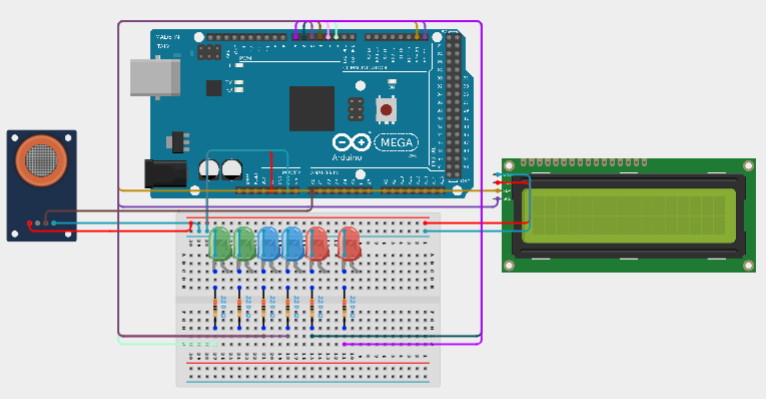

# 🍺 Etilotest utilizand Arduino Mega 2560

---

# 📖 Descriere

Acest proiect demonstreaza realizarea unui etilotest utilizand placa **Arduino Mega 2560** si un senzor de detectare a alcoolului.

Senzorul masoara concentratia vaporilor de alcool din aer, iar valoarea citita este interpretata de microcontroler pentru a determina nivelul detectat. In functie de valoarea masurata, sistemul poate semnaliza prezenta alcoolului prin intermediul elementelor de iesire utilizate in montaj.

Proiectul reprezinta o aplicatie practica pentru intelegerea functionarii senzorilor analogici si a modului de prelucrare a datelor furnizate de acestia.

---

# 🔧 Componente utilizate

- Arduino Mega 2560
- Senzor de alcool (MQ-3)
- Breadboard
- Fire de conexiune

---

# 📂 Continutul proiectului

| Fisier | Descriere |
|---------|-----------|
| Etilotest-Cod Sursa.txt | Codul sursa al proiectului |
| Schema.png | Schema electrica |
| Demo.mp4 | Demonstratie video |
| Documentatie.pdf | Documentatia completa |

---

# ▶️ Demonstratie

Functionarea proiectului poate fi observata in videoclipul **Demo.mp4**, unde este prezentata citirea valorilor furnizate de senzorul de alcool si modul de functionare al sistemului.

Explicatiile complete privind implementarea proiectului sunt disponibile in fisierul **Documentatie.pdf**.

---

# 👨‍💻 Autor

**Daniel Petrescu**

Facultatea de Electronica, Telecomunicatii si Tehnologia Informatiei

Universitatea Nationala de Stiinta si Tehnologie POLITEHNICA Bucuresti