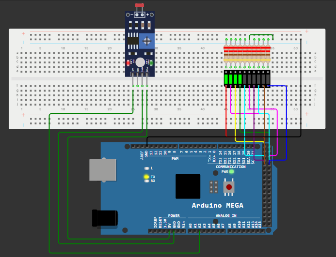

# 💡 Sistem de iluminat automat utilizand fotorezistor

---

# 📖 Descriere

Acest proiect demonstreaza realizarea unui sistem de iluminat automat utilizand placa **Arduino Mega 2560** si un fotorezistor (LDR).

Fotorezistorul masoara nivelul de lumina din mediul inconjurator, iar Arduino interpreteaza valoarea citita pentru a controla automat aprinderea sau stingerea unui LED. Atunci cand intensitatea luminii scade sub un anumit prag, LED-ul este aprins, iar atunci cand lumina este suficienta, acesta este stins.

Proiectul reprezinta o aplicatie practica pentru utilizarea senzorilor analogici in sisteme de automatizare.

---

# 🔧 Componente utilizate

- Arduino Mega 2560
- Fotorezistor (LDR)
- LED
- Rezistenta 220 ohmi
- Rezistenta 10 kohmi
- Breadboard
- Fire de conexiune

---

# 📂 Continutul proiectului

| Fisier | Descriere |
|---------|-----------|
| Fotorezistor-Cod Sursa.txt | Codul sursa al proiectului |
| Schema.png | Schema electrica |
| Demo.mp4 | Demonstratie video |
| Documentatie.pdf | Documentatia completa |

---

# ▶️ Demonstratie

Functionarea proiectului poate fi observata in videoclipul **Demo.mp4**, unde este prezentata detectarea variatiilor de lumina ambientala si controlul automat al LED-ului in functie de valoarea citita de fotorezistor.

Explicatiile complete privind implementarea proiectului sunt disponibile in fisierul **Documentatie.pdf**.

---

# 👨‍💻 Autor

**Daniel Petrescu**

Facultatea de Electronica, Telecomunicatii si Tehnologia Informatiei

Universitatea Nationala de Stiinta si Tehnologie POLITEHNICA Bucuresti