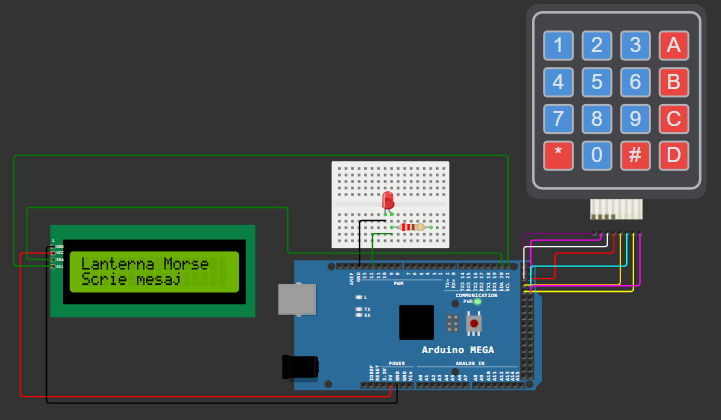

# 🔦 Lanterna Cod Morse utilizand Arduino Mega 2560

---

# 📖 Descriere

Acest proiect demonstreaza implementarea unei lanterne capabile sa transmita mesaje utilizand alfabetul Morse, folosind placa **Arduino Mega 2560**.

Microcontrolerul controleaza aprinderea si stingerea unui LED conform regulilor codului Morse, fiecare litera fiind reprezentata printr-o succesiune de impulsuri luminoase scurte si lungi. Proiectul evidentiaza utilizarea functiilor de temporizare si controlul iesirilor digitale pentru transmiterea unui mesaj luminos.

Aplicatia reprezinta un exemplu practic de utilizare a microcontrolerelor pentru realizarea sistemelor de semnalizare.

---

# 🔧 Componente utilizate

- Arduino Mega 2560
- LED
- Rezistenta 220 ohmi
- Breadboard
- Fire de conexiune

---

# 📂 Continutul proiectului

| Fisier | Descriere |
|---------|-----------|
| Lanterna Cod Morse-Cod Sursa.txt | Codul sursa al proiectului |
| Schema.png | Schema electrica |
| Demo.mp4 | Demonstratie video |
| Documentatie.pdf | Documentatia completa |

---

# ▶️ Demonstratie

Functionarea proiectului poate fi observata in videoclipul **Demo.mp4**, unde este prezentata transmiterea unui mesaj prin intermediul impulsurilor luminoase generate conform alfabetului Morse.

Explicatiile complete privind implementarea proiectului sunt disponibile in fisierul **Documentatie.pdf**.

---

# 👨‍💻 Autor

**Daniel Petrescu**

Facultatea de Electronica, Telecomunicatii si Tehnologia Informatiei

Universitatea Nationala de Stiinta si Tehnologie POLITEHNICA Bucuresti