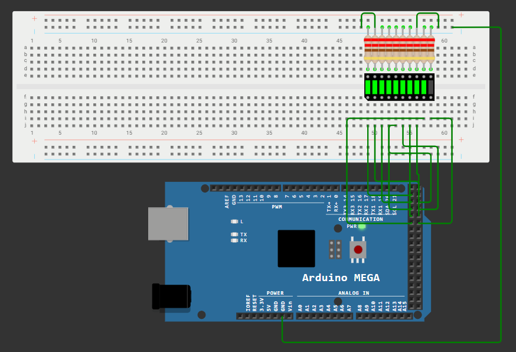

# 📊 Indicator luminos cu LED Bar utilizand Arduino Mega 2560

---

# 📖 Descriere

Acest proiect demonstreaza utilizarea unui modul **LED Bar** impreuna cu placa **Arduino Mega 2560** pentru realizarea unui indicator luminos.

LED-urile sunt aprinse progresiv in functie de logica implementata in program, simuland functionarea unui indicator de nivel. Proiectul evidentiaza controlul simultan al mai multor iesiri digitale si reprezinta o baza pentru dezvoltarea aplicatiilor de monitorizare si afisare vizuala.

---

# 🔧 Componente utilizate

- Arduino Mega 2560
- Modul LED Bar (10 segmente)
- Breadboard
- Fire de conexiune

---

# 📂 Continutul proiectului

| Fisier | Descriere |
|---------|-----------|
| Ledbar-Cod Sursa.txt | Codul sursa al proiectului |
| Schema.png | Schema electrica |
| Demo.mp4 | Demonstratie video |
| Documentatie.pdf | Documentatia completa |

---

# ▶️ Demonstratie

Functionarea proiectului poate fi observata in videoclipul **Demo.mp4**, unde este prezentata aprinderea progresiva a segmentelor modulului LED Bar conform algoritmului implementat.

Explicatiile complete privind implementarea proiectului sunt disponibile in fisierul **Documentatie.pdf**.

---

# 👨‍💻 Autor

**Daniel Petrescu**

Facultatea de Electronica, Telecomunicatii si Tehnologia Informatiei

Universitatea Nationala de Stiinta si Tehnologie POLITEHNICA Bucuresti