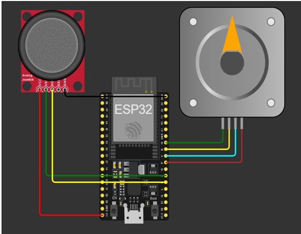

# ⚙️ Controlul unui motor Stepper utilizand Arduino Mega 2560

---

# 📖 Descriere

Acest proiect demonstreaza controlul unui motor pas cu pas (Stepper Motor) utilizand placa **Arduino Mega 2560**.

Programul controleaza rotirea motorului prin transmiterea unei secvente de comenzi catre driverul acestuia, permitand deplasarea precisa cu un numar determinat de pasi. Proiectul reprezinta o introducere in controlul motoarelor pas cu pas si evidentiaza principiile de functionare ale acestora.

Datorita simplitatii sale, proiectul este recomandat ca punct de plecare pentru intelegerea controlului motoarelor in aplicatii de automatizare si robotica.

---

# 🔧 Componente utilizate

- Arduino Mega 2560
- Motor Stepper
- Driver pentru motor (ULN2003)
- Breadboard
- Fire de conexiune

---

# 📂 Continutul proiectului

| Fisier | Descriere |
|---------|-----------|
| Motor Stepper 5.1.2-Cod Sursa.txt | Codul sursa al proiectului |
| Schema.png | Schema electrica |
| Demo.mp4 | Demonstratie video |
| Documentatie.pdf | Documentatia completa |

---

# ▶️ Demonstratie

Functionarea proiectului poate fi observata in videoclipul **Demo.mp4**, unde este prezentata rotirea motorului pas cu pas conform secventei implementate in program.

Explicatiile complete privind implementarea proiectului sunt disponibile in fisierul **Documentatie.pdf**.

---

# 👨‍💻 Autor

**Daniel Petrescu**

Facultatea de Electronica, Telecomunicatii si Tehnologia Informatiei

Universitatea Nationala de Stiinta si Tehnologie POLITEHNICA Bucuresti