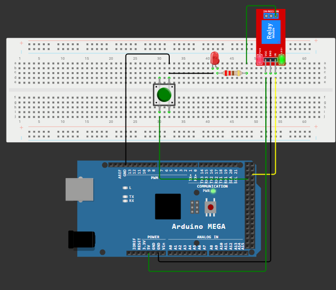

# ⚡ Controlul unui releu utilizand Arduino Mega 2560

---

# 📖 Descriere

Acest proiect demonstreaza controlul unui releu utilizand placa **Arduino Mega 2560**.

Arduino comanda activarea si dezactivarea releului prin intermediul unei iesiri digitale, iar un LED este utilizat pentru semnalizarea vizuala a starii releului. Proiectul reprezinta o introducere in utilizarea releelor pentru controlul dispozitivelor externe si evidentiaza modul de interfatare dintre microcontroler si un modul releu.

Aplicatia constituie o baza pentru dezvoltarea sistemelor de automatizare si control al echipamentelor electrice.

---

# 🔧 Componente utilizate

- Arduino Mega 2560
- Modul releu
- LED
- Rezistenta 220 Ω
- Breadboard
- Fire de conexiune

---

# 📂 Continutul proiectului

| Fisier | Descriere |
|---------|-----------|
| Releu Leduri-Cod Sursa.txt | Codul sursa al proiectului |
| Schema.png | Schema electrica |
| Demo.mp4 | Demonstratie video |
| Documentatie.pdf | Documentatia completa |

---

# ▶️ Demonstratie

Functionarea proiectului poate fi observata in videoclipul **Demo.mp4**, unde este prezentata activarea si dezactivarea releului, precum si semnalizarea starii acestuia cu ajutorul LED-ului.

Explicatiile complete privind implementarea proiectului sunt disponibile in fisierul **Documentatie.pdf**.

---

# 👨‍💻 Autor

**Daniel Petrescu**

Facultatea de Electronica, Telecomunicatii si Tehnologia Informatiei

Universitatea Nationala de Stiinta si Tehnologie POLITEHNICA Bucuresti