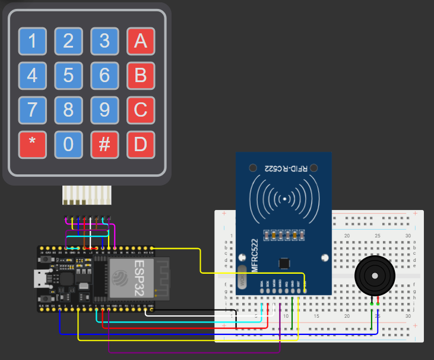

# 🔐 Sistem de autentificare RFID cu parola utilizand ESP32

---

# 📖 Descriere

Acest proiect demonstreaza realizarea unui sistem de autentificare utilizand placa **ESP32**, un modul **RFID RC522** si memoria **EEPROM**.

Sistemul permite inregistrarea unei cartele RFID impreuna cu o parola asociata, informatiile fiind stocate in memoria nevolatila a microcontrolerului. La utilizarea ulterioara, utilizatorul trebuie sa prezinte cartela RFID si sa introduca parola corespunzatoare pentru validarea accesului.

Proiectul evidentiaza utilizarea memoriei EEPROM pentru stocarea permanenta a datelor si implementarea unui mecanism simplu de autentificare bazat pe doi factori: cartela RFID si parola.

---

# 🔧 Componente utilizate

- ESP32
- Modul RFID RC522
- Cartela RFID
- EEPROM
- Breadboard
- Fire de conexiune

---

# 📂 Continutul proiectului

| Fisier | Descriere |
|---------|-----------|
| Cod Salvare Informatie Cartela cu Parola.txt | Codul sursa al proiectului |
| Schema.png | Schema electrica |
| Demo.mp4 | Demonstratie video |
| Documentatie.pdf | Documentatia completa |

---

# ▶️ Demonstratie

Functionarea proiectului poate fi observata in videoclipul **Demo.mp4**, unde este prezentat procesul de inregistrare a unei cartele RFID, salvarea parolei in memoria EEPROM si autentificarea utilizatorului utilizand cartela si parola asociata.

Explicatiile complete privind implementarea proiectului sunt disponibile in fisierul **Documentatie.pdf**.

---

# 👨‍💻 Autor

**Daniel Petrescu**

Facultatea de Electronica, Telecomunicatii si Tehnologia Informatiei

Universitatea Nationala de Stiinta si Tehnologie POLITEHNICA Bucuresti