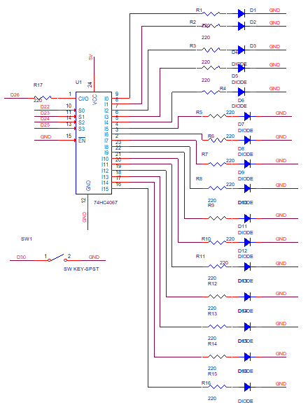

# 🎲 Ruleta electronica utilizand Arduino Mega 2560

---

# 📖 Descriere

Acest proiect demonstreaza realizarea unei rulete electronice utilizand placa **Arduino Mega 2560**.

Prin apasarea unui buton sau la pornirea aplicatiei (in functie de implementare), LED-urile sunt aprinse succesiv, simuland rotirea unei rulete. Dupa un interval de timp, secventa se opreste aleator asupra unui LED, indicand rezultatul final.

Proiectul evidentiaza utilizarea temporizarii, a functiilor pseudoaleatoare si controlul mai multor iesiri digitale pentru realizarea unui efect vizual interactiv.

---

# 🔧 Componente utilizate

- Arduino Mega 2560
- LED-uri
- Rezistente 220 ohmi
- Buton
- Breadboard
- Fire de conexiune

---

# 📂 Continutul proiectului

| Fisier | Descriere |
|---------|-----------|
| Ruleta-Cod Sursa.txt | Codul sursa al proiectului |
| Schema.png | Schema electrica |
| Demo.mp4 | Demonstratie video |
| Documentatie.pdf | Documentatia completa |

---

# ▶️ Demonstratie

Functionarea proiectului poate fi observata in videoclipul **Demo.mp4**, unde este prezentata simularea ruletei electronice si selectarea aleatorie a rezultatului final.

Explicatiile complete privind implementarea proiectului sunt disponibile in fisierul **Documentatie.pdf**.

---

# 👨‍💻 Autor

**Daniel Petrescu**

Facultatea de Electronica, Telecomunicatii si Tehnologia Informatiei

Universitatea Nationala de Stiinta si Tehnologie POLITEHNICA Bucuresti