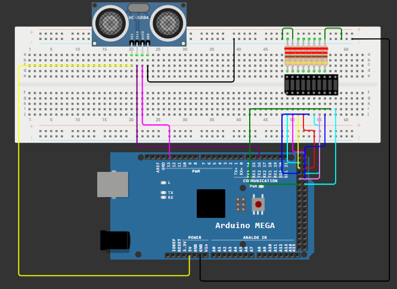

# 📏 Masurarea distantei utilizand senzorul ultrasonic HC-SR04

---

# 📖 Descriere

Acest proiect demonstreaza masurarea distantei dintre senzor si un obiect utilizand placa **Arduino Mega 2560** si senzorul ultrasonic **HC-SR04**.

Senzorul transmite un impuls ultrasonic si masoara timpul necesar pentru receptionarea ecoului reflectat de obiect. Pe baza acestui timp, Arduino calculeaza distanta pana la obstacol si afiseaza rezultatul.

Proiectul reprezinta o introducere practica in utilizarea senzorilor ultrasonici pentru detectarea obstacolelor si masurarea distantelor in aplicatii de automatizare si robotica.

---

# 🔧 Componente utilizate

- Arduino Mega 2560
- Senzor ultrasonic HC-SR04
- Breadboard
- Fire de conexiune

---

# 📂 Continutul proiectului

| Fisier | Descriere |
|---------|-----------|
| Senzor distanta-Cod Sursa.txt | Codul sursa al proiectului |
| Schema.png | Schema electrica |
| Demo.mp4 | Demonstratie video |
| Documentatie.pdf | Documentatia completa |

---

# ▶️ Demonstratie

Functionarea proiectului poate fi observata in videoclipul **Demo.mp4**, unde este prezentata masurarea distantei dintre senzor si un obiect, precum si actualizarea valorilor calculate de microcontroler.

Explicatiile complete privind implementarea proiectului sunt disponibile in fisierul **Documentatie.pdf**.

---

# 👨‍💻 Autor

**Daniel Petrescu**

Facultatea de Electronica, Telecomunicatii si Tehnologia Informatiei

Universitatea Nationala de Stiinta si Tehnologie POLITEHNICA Bucuresti