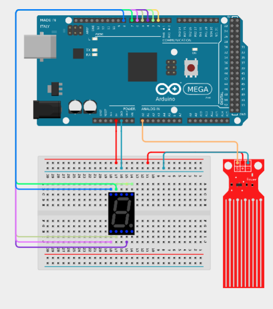

# 💧 Monitorizarea nivelului apei utilizand Arduino Mega 2560

---

# 📖 Descriere

Acest proiect demonstreaza monitorizarea nivelului apei utilizand placa **Arduino Mega 2560** si un senzor de nivel al apei.

Senzorul detecteaza nivelul lichidului prin masurarea variatiei rezistentei electrice pe suprafata acestuia, iar Arduino interpreteaza valorile citite pentru a determina nivelul apei. In functie de implementarea programului, sistemul poate afisa sau semnaliza nivelul detectat.

Proiectul reprezinta o aplicatie practica pentru utilizarea senzorilor analogici in sisteme de monitorizare si automatizare.

---

# 🔧 Componente utilizate

- Arduino Mega 2560
- Senzor de nivel al apei
- Breadboard
- Fire de conexiune

---

# 📂 Continutul proiectului

| Fisier | Descriere |
|---------|-----------|
| Senzor Apa-Cod Sursa.txt | Codul sursa al proiectului |
| Schema.png | Schema electrica |
| Demo.mp4 | Demonstratie video |
| Documentatie.pdf | Documentatia completa |

---

# ▶️ Demonstratie

Functionarea proiectului poate fi observata in videoclipul **Demo.mp4**, unde este prezentata detectarea nivelului apei cu ajutorul senzorului si interpretarea valorilor citite de microcontroler.

Explicatiile complete privind implementarea proiectului sunt disponibile in fisierul **Documentatie.pdf**.

---

# 👨‍💻 Autor

**Daniel Petrescu**

Facultatea de Electronica, Telecomunicatii si Tehnologia Informatiei

Universitatea Nationala de Stiinta si Tehnologie POLITEHNICA Bucuresti