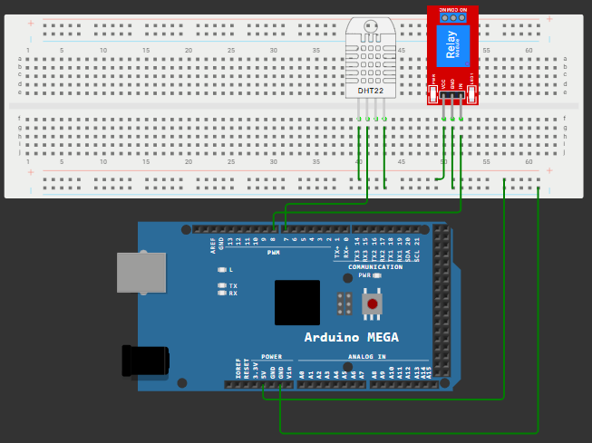

# 🌡️ Controlul unui releu in functie de temperatura utilizand DHT11

---

# 📖 Descriere

Acest proiect demonstreaza realizarea unui sistem automat de control utilizand placa **Arduino Mega 2560**, senzorul de temperatura **DHT11** si un modul releu.

Senzorul DHT11 masoara temperatura mediului inconjurator, iar Arduino compara valoarea citita cu un prag prestabilit. Atunci cand temperatura depaseste valoarea setata, releul este activat, iar atunci cand temperatura scade sub acest prag, releul este dezactivat.

Proiectul reprezinta o aplicatie practica pentru automatizarea sistemelor de ventilatie, incalzire sau racire, bazata pe monitorizarea temperaturii.

---

# 🔧 Componente utilizate

- Arduino Mega 2560
- Senzor de temperatura si umiditate DHT11
- Modul releu
- Breadboard
- Fire de conexiune

---

# 📂 Continutul proiectului

| Fisier | Descriere |
|---------|-----------|
| DHT11+Releu-Cod Sursa.txt | Codul sursa al proiectului |
| Schema.png | Schema electrica |
| Demo.mp4 | Demonstratie video |
| Documentatie.pdf | Documentatia completa |

---

# ▶️ Demonstratie

Functionarea proiectului poate fi observata in videoclipul **Demo.mp4**, unde este prezentata monitorizarea temperaturii cu senzorul DHT11 si controlul automat al releului in functie de valoarea detectata.

Explicatiile complete privind implementarea proiectului sunt disponibile in fisierul **Documentatie.pdf**.

---

# 👨‍💻 Autor

**Daniel Petrescu**

Facultatea de Electronica, Telecomunicatii si Tehnologia Informatiei

Universitatea Nationala de Stiinta si Tehnologie POLITEHNICA Bucuresti