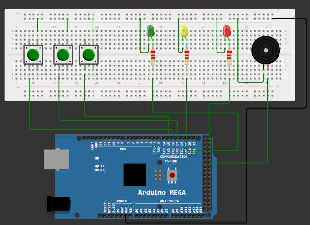

# 🎮 Jocul Simon Spune utilizand Arduino Mega 2560

---

# 📖 Descriere

Acest proiect demonstreaza implementarea jocului **Simon Spune** utilizand placa **Arduino Mega 2560**.

Microcontrolerul genereaza o secventa aleatorie de semnale luminoase, fiecare LED reprezentand o anumita pozitie. Utilizatorul trebuie sa memoreze si sa reproduca secventa prin apasarea butoanelor corespunzatoare. Dupa fiecare runda reusita, jocul adauga un nou element la secventa, crescand treptat nivelul de dificultate.

Proiectul combina utilizarea intrarilor digitale, a iesirilor digitale si a algoritmilor de generare a secventelor, reprezentand o aplicatie interactiva pentru dezvoltarea abilitatilor de memorare si atentie.

---

# 🔧 Componente utilizate

- Arduino Mega 2560
- 4 LED-uri
- 4 Butoane
- Rezistente 220 ohmi 
- Breadboard
- Fire de conexiune

---

# 📂 Continutul proiectului

| Fisier | Descriere |
|---------|-----------|
| Simon Spune-Cod Sursa.txt | Codul sursa al proiectului |
| Schema.png | Schema electrica |
| Demo.mp4 | Demonstratie video |
| Documentatie.pdf | Documentatia completa |

---

# ▶️ Demonstratie

Functionarea proiectului poate fi observata in videoclipul **Demo.mp4**, unde este prezentata generarea secventelor luminoase si interactiunea utilizatorului pentru reproducerea acestora.

Explicatiile complete privind implementarea proiectului sunt disponibile in fisierul **Documentatie.pdf**.

---

# 👨‍💻 Autor

**Daniel Petrescu**

Facultatea de Electronica, Telecomunicatii si Tehnologia Informatiei

Universitatea Nationala de Stiinta si Tehnologie POLITEHNICA Bucuresti