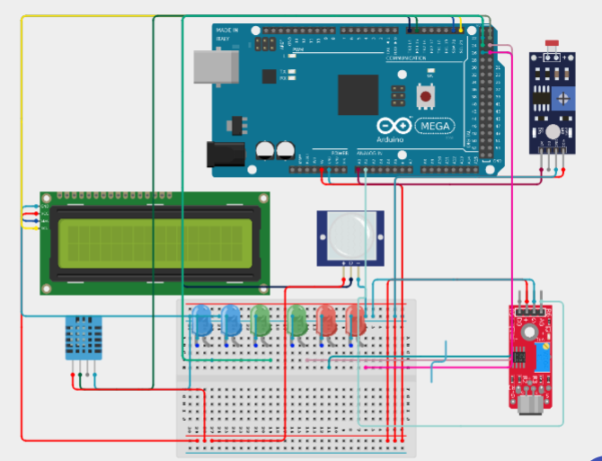

# 🌡️ Statie Multi-Senzor utilizand Arduino Mega 2560

---

# 📖 Descriere

Acest proiect demonstreaza realizarea unei statii multi-senzor utilizand placa **Arduino Mega 2560**, capabila sa colecteze si sa proceseze informatii provenite de la mai multi senzori conectati simultan.

Microcontrolerul citeste valorile furnizate de senzori si le prelucreaza in timp real, oferind o imagine de ansamblu asupra parametrilor monitorizati. Proiectul evidentiaza modul de integrare si utilizare simultana a mai multor senzori intr-o singura aplicatie embedded.

Statia multi-senzor reprezinta un exemplu practic de sistem de monitorizare ce poate fi extins pentru aplicatii de automatizare, IoT sau supravegherea mediului.

---

# 🔧 Componente utilizate

- Arduino Mega 2560
- Senzori (conform implementarii proiectului)
- Breadboard
- Fire de conexiune

---

# 📂 Continutul proiectului

| Fisier | Descriere |
|---------|-----------|
| Statie Multisenzor-Cod Sursa.txt | Codul sursa al proiectului |
| Schema.png | Schema electrica |
| Demo.mp4 | Demonstratie video |
| Documentatie.pdf | Documentatia completa |

---

# ▶️ Demonstratie

Functionarea proiectului poate fi observata in videoclipul **Demo.mp4**, unde este prezentata colectarea si procesarea datelor provenite de la senzorii utilizati in cadrul statiei multi-senzor.

Explicatiile complete privind implementarea proiectului sunt disponibile in fisierul **Documentatie.pdf**.

---

# 👨‍💻 Autor

**Daniel Petrescu**

Facultatea de Electronica, Telecomunicatii si Tehnologia Informatiei

Universitatea Nationala de Stiinta si Tehnologie POLITEHNICA Bucuresti