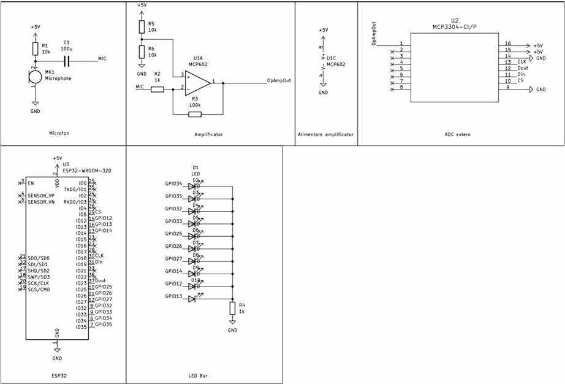

# 🎵 VU-Metru utilizand Arduino Mega 2560

---

# 📖 Descriere

Acest proiect demonstreaza realizarea unui **VU-Metru** utilizand placa **Arduino Mega 2560**, un senzor de sunet si o bara de LED-uri.

Senzorul detecteaza nivelul semnalului audio din mediul inconjurator, iar Arduino interpreteaza valorile citite pentru a controla aprinderea progresiva a LED-urilor. Pe masura ce intensitatea sunetului creste, un numar mai mare de LED-uri sunt aprinse, oferind o reprezentare vizuala a nivelului audio.

Proiectul reprezinta o aplicatie practica pentru utilizarea senzorilor analogici si a afisarii grafice prin intermediul LED-urilor.

---

# 🔧 Componente utilizate

- Arduino Mega 2560
- Senzor de sunet
- Modul LED Bar (10 segmente)
- Breadboard
- Fire de conexiune

---

# 📂 Continutul proiectului

| Fisier | Descriere |
|---------|-----------|
| Cod VU-Metru-Cod Sursa.txt | Codul sursa al proiectului |
| Schema.png | Schema electrica |
| Demo.mp4 | Demonstratie video |
| Documentatie.pdf | Documentatia completa |

---

# ▶️ Demonstratie

Functionarea proiectului poate fi observata in videoclipul **Demo.mp4**, unde este prezentata detectarea intensitatii sunetului si afisarea nivelului audio prin aprinderea progresiva a segmentelor LED Bar.

Explicatiile complete privind implementarea proiectului sunt disponibile in fisierul **Documentatie.pdf**.

---

# 👨‍💻 Autor

**Daniel Petrescu**

Facultatea de Electronica, Telecomunicatii si Tehnologia Informatiei

Universitatea Nationala de Stiinta si Tehnologie POLITEHNICA Bucuresti