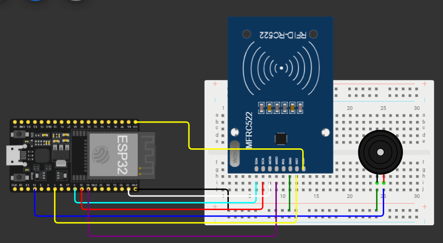

# 🖥️ Sistem de autentificare RFID utilizand ESP32 si Python

---

# 📖 Descriere

Acest proiect demonstreaza realizarea unui sistem de autentificare bazat pe tehnologia **RFID**, utilizand placa **ESP32**, modulul **RFID RC522** si o aplicatie dezvoltata in **Python**.

ESP32 citeste identificatorul unic (UID) al cartelei RFID si transmite informatia catre aplicatia Python prin intermediul comunicatiei seriale. Aplicatia proceseaza datele primite, verifica identitatea utilizatorului si afiseaza rezultatul autentificarii.

Proiectul evidentiaza integrarea unui microcontroler ESP32 cu o aplicatie software dezvoltata in Python, demonstrand comunicatia dintre componente hardware si software.

---

# 🔧 Componente utilizate

- ESP32
- Modul RFID RC522
- Cartela RFID
- Calculator
- Aplicatie dezvoltata in Python
- Cablu USB

---

# 📂 Continutul proiectului

| Fisier | Descriere |
|---------|-----------|
| RFID-Python-Cod Sursa.txt | Codul sursa pentru ESP32 |
| Python.py | Aplicatia dezvoltata in Python |
| Schema.png | Schema electrica |
| Demo.mp4 | Demonstratie video |
| Documentatie.pdf | Documentatia completa |

---

# ▶️ Demonstratie

Functionarea proiectului poate fi observata in videoclipul **Demo.mp4**, unde este prezentata citirea unei cartele RFID de catre ESP32, transmiterea datelor catre aplicatia Python si afisarea rezultatului autentificarii.

Explicatiile complete privind implementarea proiectului sunt disponibile in fisierul **Documentatie.pdf**.

---

# 👨‍💻 Autor

**Daniel Petrescu**

Facultatea de Electronica, Telecomunicatii si Tehnologia Informatiei

Universitatea Nationala de Stiinta si Tehnologie POLITEHNICA Bucuresti